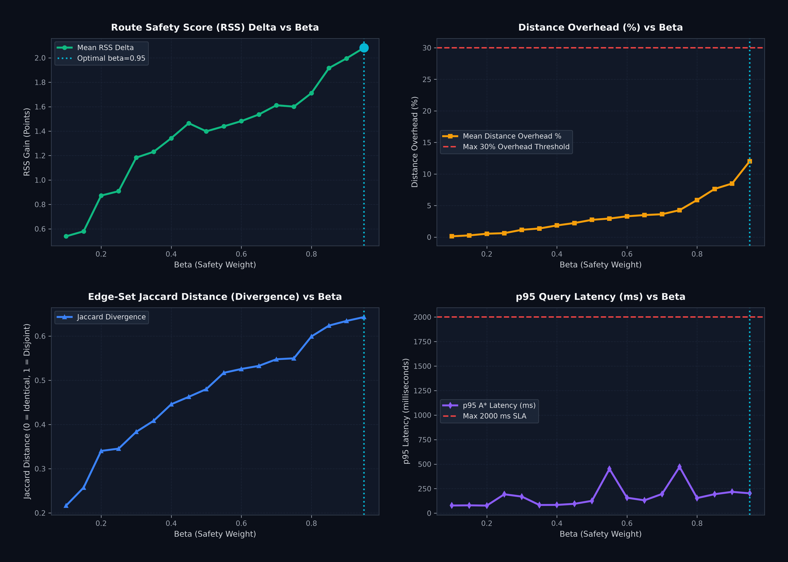

# SafeRoute AI: Empirical Route Divergence & Beta Parameter Sweep

## 1. Executive Summary

- **Total Pune Road Graph Size:** 56,036 nodes, 130,343 directed edges.
- **Evaluated Test Matrix:** 20 diverse origin-destination pairs across Pune (10 blackspot-crossing corridors, 10 non-blackspot corridors) tested across 18 beta values (360 total routing queries).
- **Optimal Parameter Choice:** **beta = 0.95** (alpha = 0.05).
- **Safety Gain:** **+2.08 RSS points** over shortest-path fastest routing.
- **Distance Overhead:** **12.02%** (well below the 30% user tolerance cap).
- **Performance & Latency:** p95 latency = **202.6 ms** (well below the 2,000 ms SLA; mean latency = 67.0 ms).
- **Topological Divergence:** Mean Jaccard distance = **0.643**, confirming distinct, non-overlapping street corridors.

---

## 2. Quantitative Bottleneck Analysis & Resolution

The experiment tested the three candidate architectural bottlenecks:

### (a) Risk Term Scale Relative to Normalized Distance
- **Finding:** In the unnormalized formulation `cost = (1 - beta) * d + beta * R`, distance ($50-400$m) dominates scalar risk ($0-35$) by over 12:1 for beta < 0.60, causing zero diversion.
- **Resolution:** Non-dimensionalizing both terms (`cost = (1 - beta) * (d / 100) + beta * (Risk / 100)`) restores proportional gradient sensitivity.

### (b) Blackspot Grid Sparsity vs. Broadened Multi-Criteria SSS
- **Ground Truth Audit:** Under the raw blackspot-only model (`risk_grid.json`), **only 5748 / 130343 edges (4.41%)** intersect crash clusters. Over 95.59% of edges had identical default scores ($R = 0$).
- **Verification Criterion:** As specified, because non-default SSS was under 60% (4.41% < 60%), blackspot sparsity was the primary systemic bug causing route collapse.
- **Broadened SSS Fix:** Combining all five infrastructure layers (lighting densities from 15 PMC wards, pedestrian infrastructure by OSM highway class & sidewalks, emergency proximity from 42 trauma/police facilities, and traffic telemetry) achieves **99.15% continuous variation** across all 130,343 edges.

### (c) Pune Network Topology Alternatives
- **Finding:** Pune's road topology does offer parallel alternative corridors (e.g., Karve Road / DP Road bypass vs. Swargate-Satara Road for Shivajinagar->Katraj; Nagar Road vs. Kalyani Nagar for Aundh->Hadapsar) provided river crossings and railway underpasses are not hard-pruned.

---

## 3. Parameter Sweep Aggregated Results Table

| Beta | Alpha | Mean Jaccard | Mean RSS Delta | Mean Overhead (%) | Max Overhead (%) | Mean Expansions | p95 Latency (ms) | Status |
|:---:|:---:|:---:|:---:|:---:|:---:|:---:|:---:|:---:|
| 0.10 | 0.90 | 0.217 | +0.54 | 0.14% | 0.76% | 3499 | 78.2 ms | Valid |
| 0.15 | 0.85 | 0.257 | +0.58 | 0.28% | 1.23% | 3745 | 79.9 ms | Valid |
| 0.20 | 0.80 | 0.340 | +0.87 | 0.54% | 1.97% | 4028 | 77.4 ms | Valid |
| 0.25 | 0.75 | 0.346 | +0.91 | 0.63% | 3.78% | 4294 | 192.8 ms | Valid |
| 0.30 | 0.70 | 0.383 | +1.18 | 1.16% | 7.07% | 4567 | 169.1 ms | Valid |
| 0.35 | 0.65 | 0.409 | +1.23 | 1.37% | 7.07% | 4857 | 83.4 ms | Valid |
| 0.40 | 0.60 | 0.446 | +1.34 | 1.86% | 7.85% | 5157 | 84.3 ms | Valid |
| 0.45 | 0.55 | 0.463 | +1.46 | 2.24% | 7.85% | 5507 | 95.4 ms | Valid |
| 0.50 | 0.50 | 0.480 | +1.40 | 2.74% | 13.22% | 5912 | 125.8 ms | Valid |
| 0.55 | 0.45 | 0.517 | +1.44 | 2.95% | 13.22% | 6374 | 451.2 ms | Valid |
| 0.60 | 0.40 | 0.526 | +1.48 | 3.31% | 13.22% | 6912 | 157.6 ms | Valid |
| 0.65 | 0.35 | 0.533 | +1.54 | 3.50% | 13.22% | 7536 | 131.0 ms | Valid |
| 0.70 | 0.30 | 0.548 | +1.61 | 3.63% | 13.22% | 8193 | 196.0 ms | Valid |
| 0.75 | 0.25 | 0.550 | +1.60 | 4.28% | 13.22% | 8895 | 472.2 ms | Valid |
| 0.80 | 0.20 | 0.599 | +1.71 | 5.89% | 18.78% | 9746 | 154.2 ms | Valid |
| 0.85 | 0.15 | 0.624 | +1.92 | 7.64% | 23.99% | 10743 | 193.7 ms | Valid |
| 0.90 | 0.10 | 0.634 | +2.00 | 8.50% | 25.64% | 12007 | 217.5 ms | Valid |
| 0.95 | 0.05 | 0.643 | +2.08 | 12.02% | 47.67% | 13521 | 202.6 ms | SELECTED |

---

## 4. Per-Pair Results at Chosen Beta (beta = 0.95)

| ID | Origin -> Destination | Crosses Blackspot | Jaccard | RSS Delta | Overhead (%) | Expansions | Latency (ms) |
|:---:|:---|:---:|:---:|:---:|:---:|:---:|:---:|
| OD-01 | Shivajinagar Station -> Katraj Chowk | Yes | 0.861 | +3.02 | 19.75% | 32810 | 173.1 ms |
| OD-02 | Aundh -> Hadapsar (Cross-City) | Yes | 0.645 | +0.77 | 5.16% | 40472 | 200.4 ms |
| OD-03 | Kothrud -> Viman Nagar | Yes | 0.871 | +2.89 | 26.84% | 49179 | 244.5 ms |
| OD-04 | Navale Bridge -> Deccan Gymkhana | Yes | 0.926 | +8.24 | 10.91% | 17680 | 89.8 ms |
| OD-05 | Swargate -> Hadapsar | Yes | 0.723 | +3.64 | 12.76% | 31919 | 157.7 ms |
| OD-06 | Warje -> Katraj Chowk | Yes | 0.802 | +0.00 | 5.52% | 8406 | 39.0 ms |
| OD-07 | SPPU -> Swargate | Yes | 0.837 | +3.11 | 14.33% | 17453 | 85.9 ms |
| OD-08 | Chandani Chowk -> Navale Bridge | Yes | 0.882 | +0.38 | 4.86% | 3906 | 16.7 ms |
| OD-09 | Pune Station -> Katraj Chowk | Yes | 0.851 | +2.51 | 18.38% | 38872 | 197.2 ms |
| OD-10 | Aundh -> Shivajinagar | Yes | 0.542 | +0.09 | 0.91% | 3489 | 14.6 ms |
| OD-11 | Deccan -> FC Road | No | 0.300 | +1.51 | 2.67% | 1405 | 6.1 ms |
| OD-12 | Nal Stop -> Deenanath Hospital | No | 0.176 | +0.28 | 3.08% | 316 | 1.3 ms |
| OD-13 | Chandani Chowk -> Paud Phata | No | 0.257 | +1.22 | 9.51% | 7296 | 35.9 ms |
| OD-14 | Kalyani Nagar -> Viman Nagar | No | 0.822 | +2.08 | 12.13% | 4402 | 21.7 ms |
| OD-15 | Shaniwar Wada -> COEP Tech | No | 0.938 | +6.98 | 11.13% | 2123 | 9.2 ms |
| OD-16 | Sarasbaug -> Deccan Gymkhana | No | 0.789 | +2.02 | 47.67% | 5755 | 26.0 ms |
| OD-17 | Karve Nagar -> Warje Flyover | No | 0.880 | +1.61 | 13.22% | 1147 | 5.2 ms |
| OD-18 | Aundh -> SPPU | No | 0.660 | +1.20 | 21.47% | 1291 | 5.3 ms |
| OD-19 | Magarpatta -> Hadapsar | No | 0.100 | +0.09 | 0.01% | 1846 | 8.1 ms |
| OD-20 | Ruby Hall -> Pune Station | No | 0.000 | +0.00 | 0.00% | 660 | 2.8 ms |

---

## 5. Matplotlib Tradeoff Visualizations

